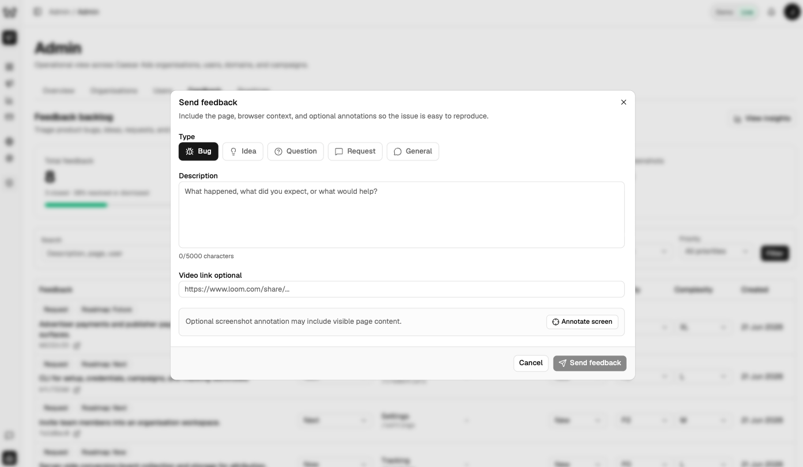
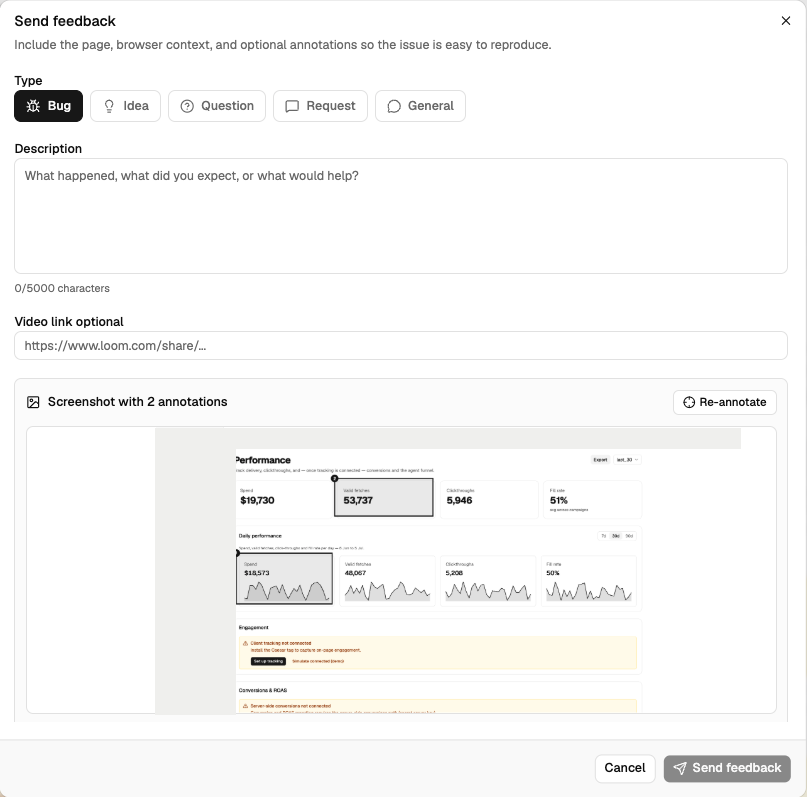
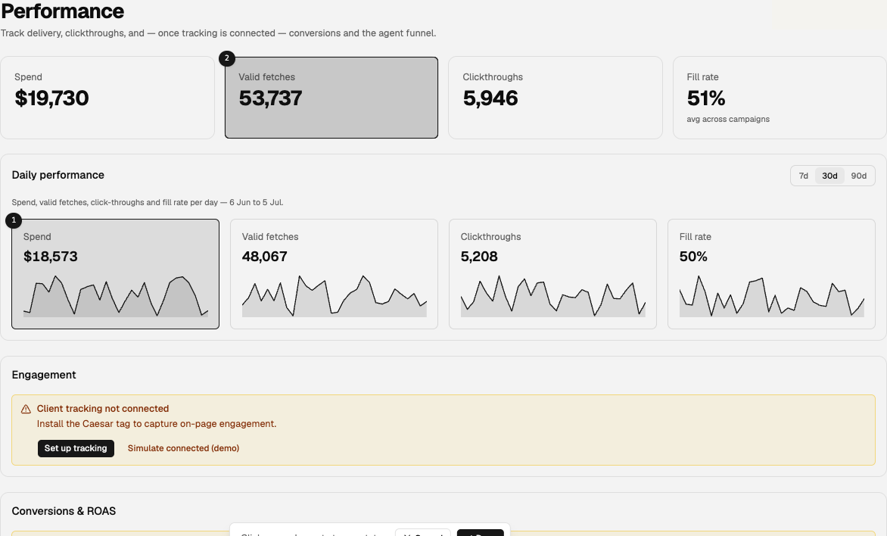
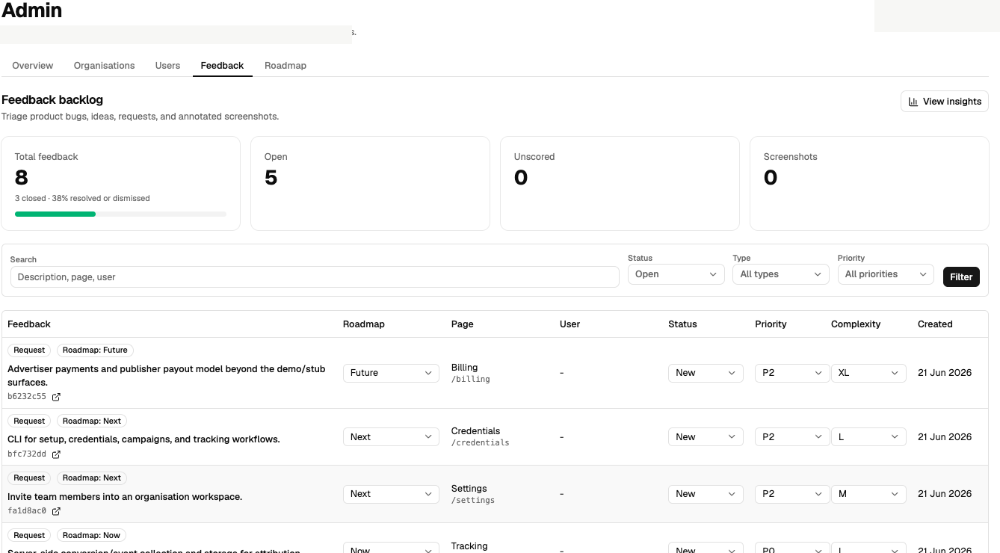
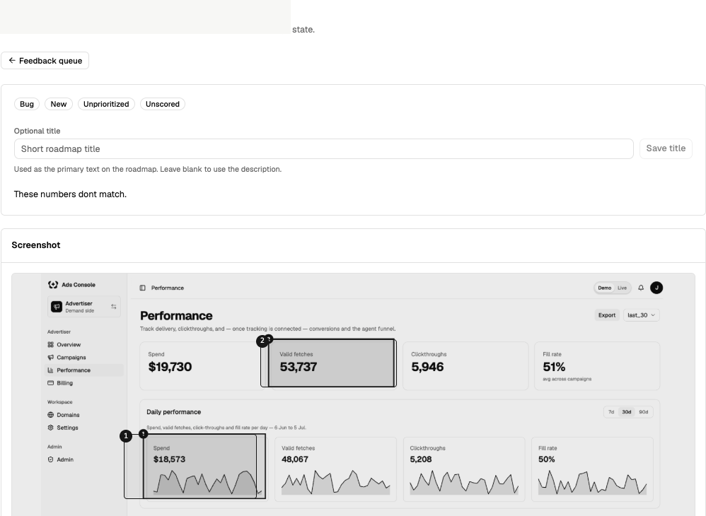
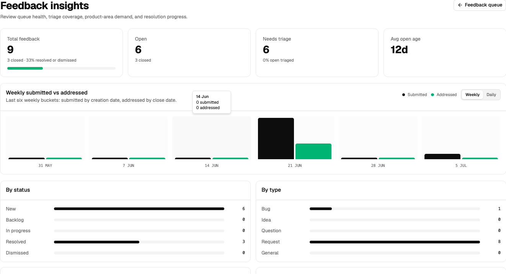

<p align="center">
  <picture>
    <source media="(prefers-color-scheme: dark)" srcset="docs/assets/feedy-mark-dark.svg">
    
  </picture>
</p>

# Feedy

Feedy is an open-source product feedback system for builders who want feedback to move directly into AI-assisted development.

The goal is to make rich feedback easy to add to a product, then make that feedback immediately usable by coding agents. People can review, triage, and prioritize the queue, but Feedy is optimized for agents to pick up feedback, understand the context, and help execute fixes or improvements in minutes rather than days.

## Why

Most feedback tools collect reports, votes, or tickets. Feedy is designed for the next step: moving validated feedback into AI-assisted development without losing the context needed to act on it.

The core loop:

1. Capture feedback in-product.
2. Preserve route, page, screenshot, browser, environment, release, user, and organization context.
3. Let humans review and prioritize.
4. Expose structured context to coding agents.
5. Move from report to useful implementation work in minutes, not days.

## Current Status

Feedy is at the contract-first reference implementation stage.

This repository currently includes:

- Shared TypeScript/Zod contracts.
- Initial Postgres migration.
- Basic intake and agent-context example.
- Copyable reference UI example for the core feedback surfaces.
- Storage guidance.
- Quickstart docs.

It is not yet a complete hosted app, but the repository is intended to make the core feedback capability easy to inspect, copy, and integrate.

## Quickstart

```bash
npm install
npm run typecheck
```

Start with:

- `docs/quickstart.md`
- `docs/storage.md`
- `packages/contracts/src/index.ts`
- `packages/db/migrations/0001_feedback_core.sql`
- `examples/basic-intake`
- `examples/ui-reference`

## Core Pieces

- `@feedy/contracts`: shared feedback schemas and types.
- `packages/db/migrations`: Postgres schema.
- `examples/basic-intake`: minimal intake and agent-context example.
- `examples/ui-reference`: copyable UI surfaces for the widget, queue, detail, insights, and agent context.

## UI Reference

Run the reference UI locally:

```bash
npm run dev:ui
```

The UI is intentionally copyable example code, not a finished component library.

## Screenshots

Early UI references:

### Feedback Widget



Code: [`examples/ui-reference/src/components/FeedbackWidget.tsx`](examples/ui-reference/src/components/FeedbackWidget.tsx)

### Feedback Widget With Screenshot



Code: [`examples/ui-reference/src/components/FeedbackWidget.tsx`](examples/ui-reference/src/components/FeedbackWidget.tsx)

### Screenshot Annotation



Code: [`examples/ui-reference/src/components/ScreenshotAnnotator.tsx`](examples/ui-reference/src/components/ScreenshotAnnotator.tsx)

### Admin Queue



Code: [`examples/ui-reference/src/components/FeedbackQueue.tsx`](examples/ui-reference/src/components/FeedbackQueue.tsx)

### Feedback Detail



Code: [`examples/ui-reference/src/components/FeedbackDetail.tsx`](examples/ui-reference/src/components/FeedbackDetail.tsx)

### Insights



Code: [`examples/ui-reference/src/components/FeedbackInsights.tsx`](examples/ui-reference/src/components/FeedbackInsights.tsx)

### Agent Context

Code: [`examples/ui-reference/src/components/AgentContextPanel.tsx`](examples/ui-reference/src/components/AgentContextPanel.tsx)

These are early reference screenshots. Final Feedy screenshots should use Feedy branding and seeded demo data as the reference app matures.

## Storage

The default production store is Postgres. Host applications can embed Feedy tables into their existing database and protect admin routes with their existing auth.

Screenshots can start in database mode for demos and early implementation, then move to object storage for production volume.
